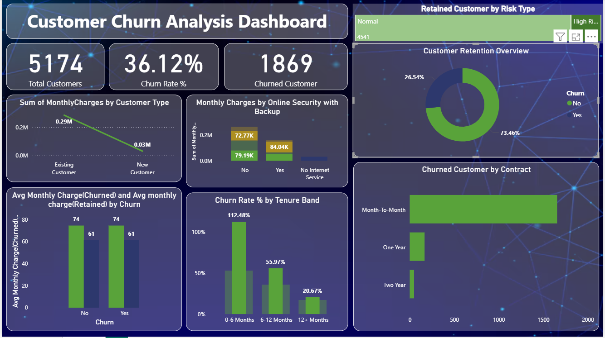

# 📊 Customer Churn Analysis Project
# 📌 Overview

This project focuses on analyzing customer churn behavior using a telecom dataset. The goal is to identify patterns, key factors, and insights that contribute to customer attrition, and help businesses improve customer retention strategies.

# 🎯 Objectives

Analyze customer demographics and service usage

Identify key factors affecting churn

Build meaningful KPIs and measures

Visualize churn trends using dashboards

Provide actionable business insights

# 📷 Dashboard Preview

# 📂 Dataset Details (Enhanced View)

This dataset captures customer behavior, subscription details, and billing information to analyze churn patterns effectively.

# 🧾 Customer Information

customerID → Unique identifier assigned to each customer

gender → Customer gender (Male / Female)

SeniorCitizen → Indicates if the customer is a senior citizen (1 = Yes, 0 = No)

Partner → Whether the customer has a partner (Yes / No)

Dependents → Whether the customer has dependents (Yes / No)

# 📞 Service Subscription Details

PhoneService → Availability of phone service

MultipleLines → Whether multiple lines are subscribed

InternetService → Type of internet service (DSL / Fiber Optic / None)

# 🔐 Value-Added Services

OnlineSecurity → Subscription to online security service

OnlineBackup → Backup service availability

DeviceProtection → Device protection plan

TechSupport → Access to technical support

# 🎬 Entertainment Services

StreamingTV → Subscription to TV streaming

StreamingMovies → Subscription to movie streaming

# 📃 Contract & Billing Information

Contract → Type of contract (Monthly / 1 Year / 2 Year)

PaperlessBilling → Billing mode (Paperless or not)

PaymentMethod → Mode of payment used

# 💰 Financial Metrics

MonthlyCharges → Amount charged per month

TotalCharges → Total amount billed to the customer

tenure → Duration (in months) the customer has stayed

# 🔄 Target Variable

Churn → Indicates whether the customer has left the service (Yes / No)

# 🧮 Measures / KPIs Created

Based on your Power BI / analysis work, typical measures include:

Total Customers

Churn Customers

Churn Rate (%)

Average Monthly Charges

Average Tenure

Revenue Lost due to Churn

# 📊 Key Insights

Customers with month-to-month contracts have higher churn

High monthly charges correlate with increased churn

Customers without Tech Support / Security services are more likely to leave

Fiber optic users show higher churn compared to DSL

Long tenure customers are less likely to churn

# 📈 Dashboard Features

Churn distribution (Yes vs No)

Churn by Contract Type

Churn by Payment Method

Monthly Charges vs Churn

Tenure vs Churn

Service-wise churn analysis

# 🛠️ Tools Used

Power BI (for dashboard & DAX measures)

Excel / CSV (data source)

Data Cleaning & Transformation

# 🚀 How to Use

Load dataset into Power BI / Excel

Clean and transform data

Create measures (KPIs)

Build visual dashboards

Analyze churn patterns
